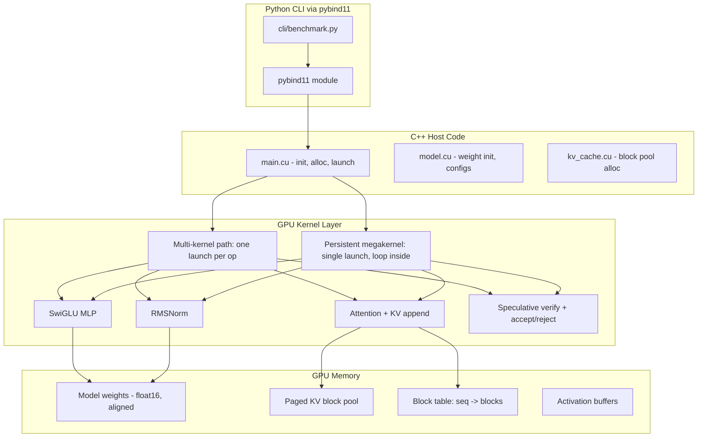
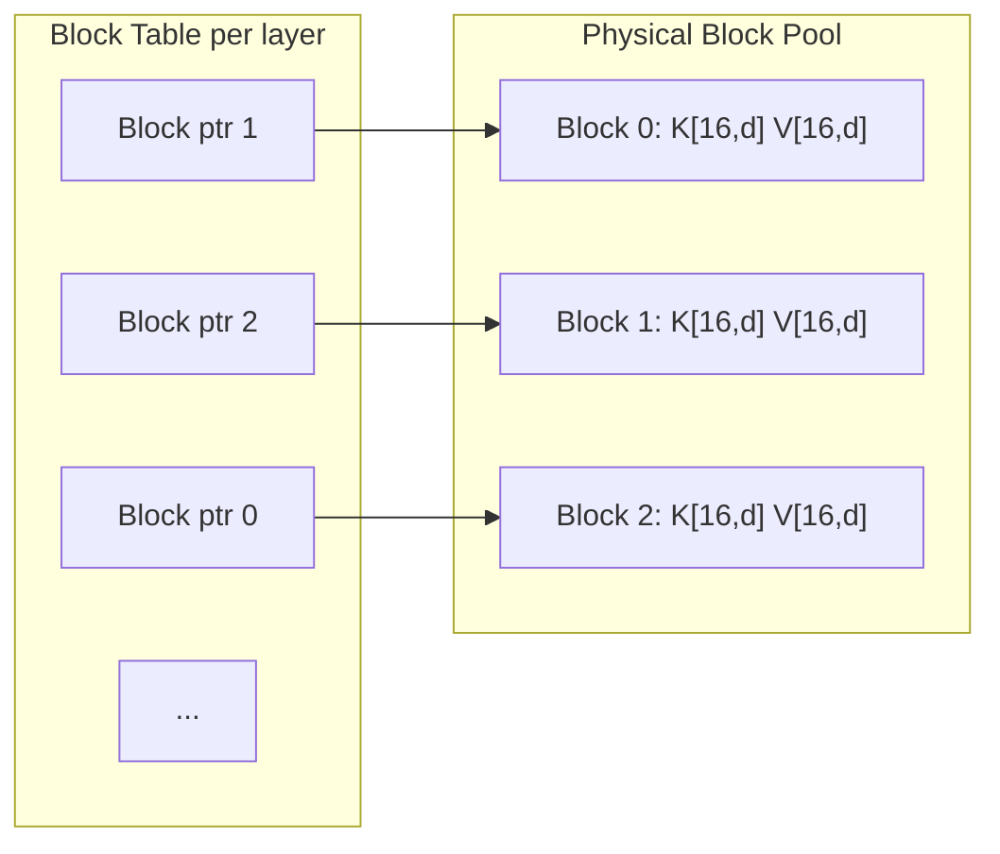
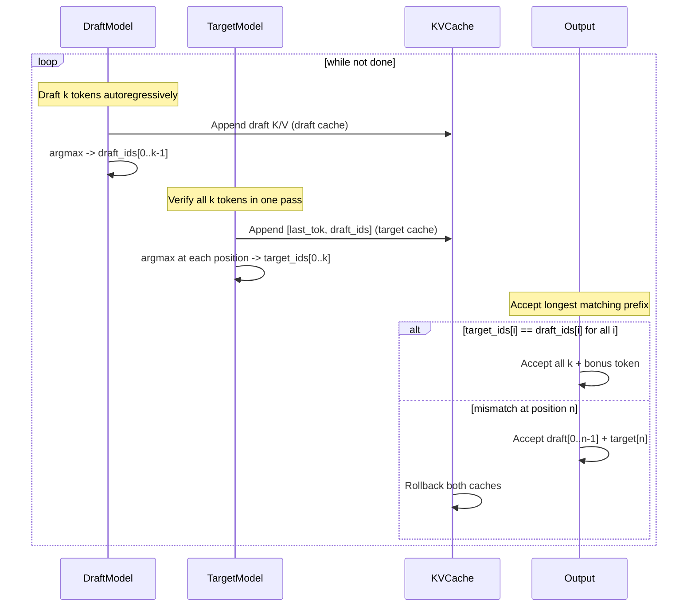

# C++/CUDA Speculative Decoding Engine

## Architecture Overview



## Model Design

Two minimal transformers sharing the same architecture but different sizes:

- **Draft model**: 2 layers, d_model=128, 1 head, d_head=128
- **Target model**: 4 layers, d_model=256, 1 head, d_head=256

Each layer: RMSNorm -> Single-Head Attention -> RMSNorm -> SwiGLU MLP

Weights randomly initialized with small stddev. Vocab size = 256 (dummy integer tokenizer). All weights in float16 with 16-byte alignment for vectorized `float4` loads.

## KV Cache -- Paged Block Design



- Block size: 16 tokens
- Each block stores `K[16][d_head]` and `V[16][d_head]` in float16 contiguously
- Memory layout per block: `[K_row0, K_row1, ..., K_row15, V_row0, ..., V_row15]`
- Block table: `int block_table[MAX_LAYERS][MAX_BLOCKS]` mapping logical block index to physical pool slot
- `seq_len` counter per sequence tracks current fill position
- **Append**: compute `block_idx = seq_len / BLOCK_SIZE`, `slot = seq_len % BLOCK_SIZE`, write K/V
- **Rollback**: set `seq_len = target_len`, no deallocation needed (blocks reused on next append)
- Pool pre-allocated at init; no dynamic allocation during generation

## Speculative Decoding Loop (GPU-resident)



Greedy mode only for the CUDA implementation (matching the greedy fast-path from the Python code). The accept/reject is a simple argmax comparison loop.

## File Structure

```
cuda/
  include/
    config.h          Model configs, constants (dims, block size, max seq len)
    kv_cache.h        KVBlock struct, BlockTable, device functions
    model.h           ModelWeights struct, layer configs
    utils.h           Device math: softmax, rmsnorm, warp reduce
    kernels.h         Kernel launch wrappers + megakernel entry
  src/
    main.cu           Host: alloc, init weights, launch, read results
    kv_cache.cu       Host pool alloc + device append/rollback functions
    model.cu          Device: attention, swiglu_mlp, rmsnorm, full_layer
    utils.cu          Device: warp_reduce, block_softmax, vectorized loads
    kernels.cu        Multi-kernel launches + persistent megakernel
    binding.cu        pybind11 module exposing run_benchmark()
  Makefile
  CMakeLists.txt
cli/
  benchmark.py        Python CLI calling the pybind11 module
```

## Kernel Design Detail

### Multi-kernel path (flag: `--mode=multi`)
Each generation step launches separate kernels:
- `rmsnorm_kernel` -- one block per row
- `attention_kernel` -- one warp per query position, iterates over KV blocks
- `mlp_kernel` -- one block per row, SwiGLU in shared memory
- `argmax_kernel` -- reduction to find next token
- `speculative_verify_kernel` -- compare draft vs target argmax arrays

### Persistent megakernel path (flag: `--mode=mega`)
Single kernel launched once with cooperative groups:
- Grid: enough blocks to cover one layer's computation
- Main thread (block 0, thread 0) runs the generation control loop
- Barrier via `cooperative_groups::grid::sync()` between phases
- All threads participate in matmul/attention/MLP as needed
- Shared memory reused across phases (double-buffered)
- Completion signaled via device-mapped host memory (zero-copy flag)

Key warp-level primitives used:
- `__shfl_xor_sync` for warp-level reductions (softmax, rmsnorm)
- `__shfl_sync` for broadcasting argmax results
- Vectorized `float4` / `half2` loads for weight reads

## Implementation Order and Dependencies

The implementation proceeds bottom-up: device math utilities first, then model layers, then KV cache, then kernels, then host orchestration, then pybind11 binding.

## Testing

- Dummy tokenizer: tokens are integers 0-255
- Initialize weights with small random values (deterministic seed)
- Run baseline (target-only) for 32 tokens
- Run speculative (draft+target) for 32 tokens
- Print both token sequences
- Verify identical output (greedy mode guarantees this)
- Print timing: tokens/sec, total time, acceptance rate
